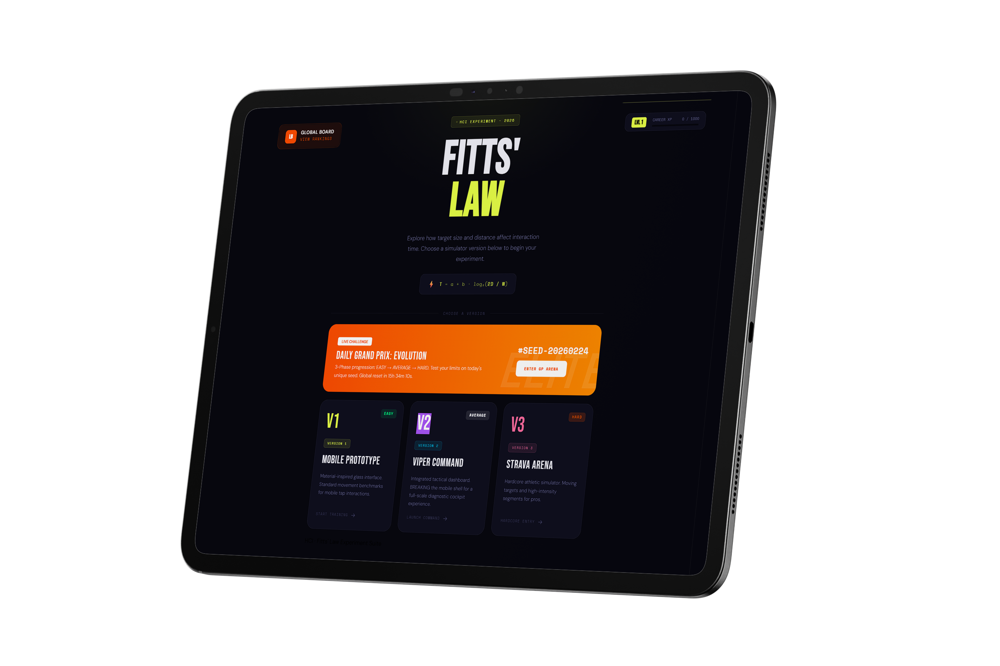

# Fitts Law Simulator

A comprehensive, interactive suite of mobile prototypes designed to demonstrate and test Fitts' Law through various user interface designs and interaction patterns.

## Overview

Fitts' Law is a predictive model of human movement primarily used in human-computer interaction and ergonomics. This project provides three distinct mobile UI implementations to simulate and measure the efficiency of target acquisition based on button size and distance.

## Simulator Versions

The project consists of three progressive versions, each offering a different aesthetic and functional approach:

### Version 1: Mobile Prototype
A clean, functional mobile UI designed for rapid testing. It includes a structured experimental flow with a splash screen, detailed instructions, and a hit-based target acquisition experiment.

### Version 2: Enhanced interaction
Features a more sophisticated visual design with neon accents and refined typography. This version focuses on providing real-time visual feedback and a more immersive mobile simulation environment.

### Version 3: iPhone Simulator
A high-fidelity hardware-level simulation of an iPhone. It tracks metrics across small, medium, and large target sizes, providing comprehensive analytical results upon completion of the experiment.

## Core Features

- **Interactive Experiments**: Measure target acquisition times across different button sizes and distances.
- **Responsive Web Design**: The home page and all simulator versions are optimized for various viewport sizes.
- **Analytical Results**: View detailed performance breakdowns, including total hits, average time, and best hit metrics.
- **Progressive Navigation**: Seamless transition between instructions, experimental phases, and results.

## Technical Implementation

- **Languages**: HTML5, CSS3, JavaScript (ES6+).
- **Typography**: Inter, Space Mono, Barlow Condensed.
- **Design Patterns**: Phone-shell UI simulation, dynamic grid generators, and responsive layout systems.

## Usage

1. Open `index.html` in a modern web browser.
2. Select a simulator version (V1, V2, or V3).
3. Follow the on-screen instructions to begin the Fitts' Law experiment.
4. Review your performance data on the results screen.
5. Use the "Home" button at the top right of any version to return to the main selection screen.

## Project Structure

- `index.html`: Main navigation and project home page.
- `fitts-law-v1.html`: Base mobile prototype implementation.
- `fitts-law-v2.html`: Enhanced mobile prototype with updated styling.
- `fitts-law-v3.html`: High-fidelity iPhone hardware simulation.
- `image.png`: Project overview visualization.
